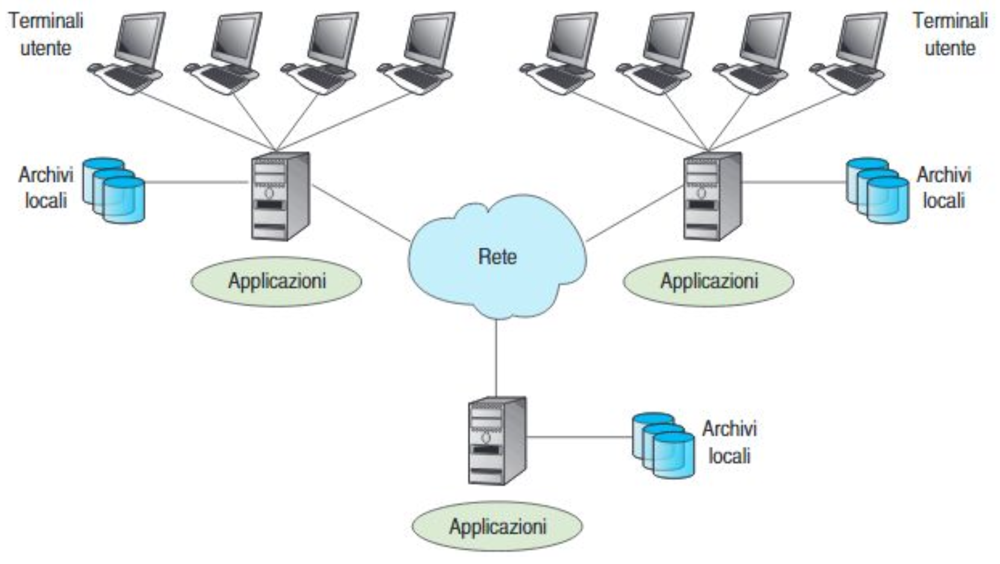

# Sistemi distibuiti
Un sistema distribuito è un insieme di componenti software indipendenti che appaiono all'utente come un unico sistema coerente.

Un sistema informatico distribuito realizza almeno una di queste situazioni:
- **Elaborazione distribuita**: le applicazioni, fra loro cooperanti, risiedono su più nodi elaborativi
- **Base di dati distribuita**: il patrimonio informativo, unitario, è ospitato su più nodi elaborativi

## Caratteristiche di un sistema distibuito
**Più componenti autonomi**
- **Definizione**: Il sistema è composto da molteplici unità di elaborazione indipendenti.
- **Autonomia**: Ogni componente può operare indipendentemente, prendendo decisioni locali.
- **Esempio**: Client web, Server web, dbms, application server. Sono tutti software autonomi e indipendenti che collaborano tra loro per implementare le funzionalità del sistema.

**Componenti su macchine diverse**
- **Definizione**: I componenti del sistema sono distribuiti su hardware fisicamente separato.
- **Distribuzione geografica**: Le macchine possono trovarsi in luoghi diversi, anche molto distanti tra loro.
- **Esempio**: Servizi cloud distribuiti in data center globali (es. Google workspace).

**Comunicazione tramite rete**
- **Definizione**: I componenti interagiscono scambiando messaggi attraverso una rete di comunicazione.
- **comunicazione**: Utilizzo di protocolli di rete come TCP/IP, HTTP, ecc.
- **Esempio**: Comunicazione client-server in un'applicazione web, trasferimento torrent in peer to peer.

**Appare come sistema unico**
- **Definizione**: Nonostante la distribuzione, il sistema si presenta all'utente come un'entità singola e coerente.
- **Trasparenza**: La complessità e la distribuzione sono nascoste all'utente finale.
- **Esempio**: Un servizio di posta elettronica web-based (Google gmail).

**Coordinazione delle attività**
- **Definizione**: I componenti collaborano e sincronizzano le loro azioni per raggiungere obiettivi comuni.
- **Meccanismi**: Utilizzo di algoritmi distribuiti, gestione delle transazioni, sistemi di lock.
- **Esempio**: Gestione della coerenza dei dati in un sistema di prenotazione di voli (uno stesso posto non deve essere prenotato da più utenti connessi contemporaneamente).

**Riassumendo**, per identificare se un sistema può essere definiro come distribuito, basta compilare la seguente check-list.

| Caratteristica                | Sì/No |
|-------------------------------|-------|
| Più componenti autonomi       |       |
| Componenti su macchine diverse|       |
| Comunicazione tramite rete    |       |
| Appare come sistema unico     |       |
| Coordinazione delle attività  |       |

Esistono diversi tipi di sistemi distribuiti.
Il primo che esaminiamo è il sistema **Client Server su Web**.

[Clicca qui per continuare](./doc/doc01_client_server.md)
