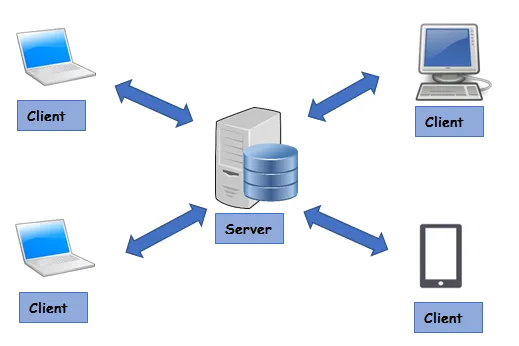

# Applicazioni Client Server su Web:

## Server e client

Introduciamo i concetti di server e client.

Il server è un computer in rete dotato di un software che fornisce servizi e risorse ad altri computer, noti come client. Quando un utente visita un sito web, il suo computer diventa un client e si connette al server che ospita il sito.

Il client comunica con il server mediante richieste e risposte HTTP. Il client invia una richiesta al server, che elabora la richiesta e restituisce una risposta al client. Le richieste e le risposte sono generalmente costituite da messaggi che contengono codice HTML, CSS, JavaScript e altri dati che permettono di visualizzare la pagina web.

Come si può notare dalla figura, di solito, insieme al server c'è un DBMS (Database Management System), che è un software che può funzionare sullo stesso computer del server oppure su un computer separato, ma accessibile solo dal server. Il DBMS Si occupa completamente dei dati usati dal server per soddisfare le richieste che provengono dai client.

Proviamo a compilare la tabella definita precedentemente per stabilire se un sistema di questo tipo è un sistema distribuito.

| Caratteristica                 | Sì/No                                                                                               |
| -------------------------------- | ------------------------------------------------------------------------------------------------- |
| Più componenti autonomi       | Sì: web browser, web server, application server, dbms                                                |
| Componenti su macchine diverse | Sì, i diversi componenti sono installati su nodi diversi                             |
| Comunicazione tramite rete     | Sì, il termine **Web** in applicazioni Client Server Web implica l'uso del protocollo http su rete Internet                               |
| Appare come sistema unico      | Sì, ogni client ha l'impressione che le funzionalità siano implementate in locale                   |
| Coordinazione delle attività  | Sì, il server, il web server, il dbms devono coordinarsi per tenere coerente e funzionante il sistema |

## Vantaggi e svantaggi dell'utilizzo di una applicazione client server web

### Vantaggi:

- **Scalabilità**: Facile aggiungere più client o potenziare il server per gestire un carico maggiore.
- **Centralizzazione dei dati**: I dati sono gestiti centralmente sul server, facilitando backup e manutenzione.
- **Sicurezza**: È possibile implementare misure di sicurezza robuste sul lato server.
- **Accesso remoto**: Gli utenti possono accedere all'applicazione da qualsiasi luogo con una connessione internet.
- **Aggiornamenti semplificati**: L'aggiornamento del software sul server si riflette immediatamente per tutti i client.
- **Risorse ottimizzate**: I client possono essere "leggeri", poiché la maggior parte dell'elaborazione avviene sul server.
- **Interoperabilità**: Diversi tipi di client (browser, app mobile) possono interagire con lo stesso server.
- **Standardizzazione**: L'uso di protocolli web standard (HTTP/HTTPS) facilita lo sviluppo e l'integrazione.

### Svantaggi:

- **Dipendenza dalla rete**: Se la connessione internet è lenta o assente, l'applicazione potrebbe non funzionare.
- **Latenza**: Le richieste al server e le risposte possono introdurre ritardi, specialmente su connessioni lente.
- **Sovraccarico del server:** Un numero elevato di richieste contemporanee può sovraccaricare il server.
- **Punto singolo di fallimento**: Se il server va offline, l'intero sistema diventa inutilizzabile.
- **Costi di infrastruttura**: Mantenere server potenti e affidabili può essere costoso.
- **Complessità**: La gestione di un'architettura distribuita può essere più complessa rispetto a un'applicazione stand-alone.
- **Problemi di privacy**: La centralizzazione dei dati sul server può sollevare preoccupazioni sulla privacy.
- **Sicurezza**: Nonostante i vantaggi in termini di sicurezza, il server diventa un obiettivo attraente per gli attacchi.
- **Limitazioni del client**: Le capacità del browser o del dispositivo client possono limitare le funzionalità dell'applicazione.
- **Gestione delle sessioni**: Mantenere lo stato della sessione in un'architettura stateless come HTTP può essere complesso.

Questi vantaggi e svantaggi forniscono una panoramica delle implicazioni dell'utilizzo di un sistema client-server su web. La scelta di utilizzare questa architettura dipenderà dalle specifiche esigenze del progetto, considerando attentamente questi fattori.

Prossima lezione: implementiamo un Web Client
[Clicca qui per continuare](./doc02_client_web.md)
