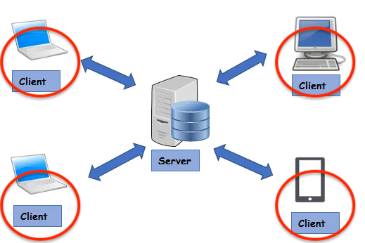
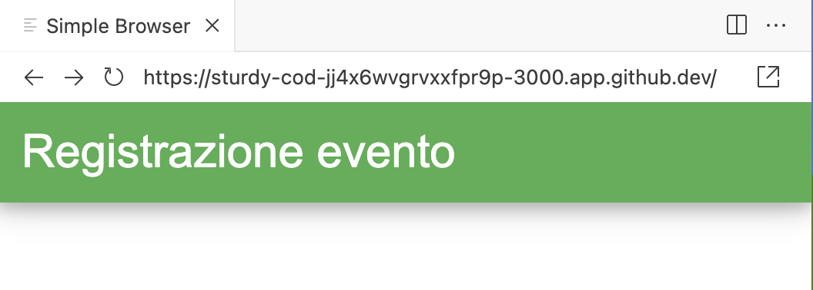

# Applicazioni Client Server su Web: il Client

Link utili<br/>
https://www.w3schools.com/w3css/w3css_intro.asp<br/>
https://www.w3schools.com/w3css/w3css_input.asp<br/>
https://www.w3schools.com/html/html_form_input_types.asp



## Introduzione
Quando si crea un'applicazione Client Server su web, spesso si ha la necessità di permettere all'utente di inserire dei dati o di interagire con il sito stesso. In questi casi, si utilizzano i form HTML.

I form consentono di creare una struttura in cui l'utente può inserire dati, selezionare opzioni, e inviare il tutto al server per elaborare i dati inseriti. Grazie ai form, si può creare un'interazione tra il sito web e il server, che permette all'utente di usufruire dei servizi offerti dal sito stesso.


## Utilizzo dei form HTML
Il form (modulo) è uno strumento fondamentale per permettere all'utente di inviare dati al server e interagire con le pagine web. In particolare, i form client-side sono costituiti da una serie di elementi che possono essere utilizzati per raccogliere informazioni dall'utente e inviarle al server tramite una richiesta. Uno dei framework CSS più utilizzati per implementare i form è w3.css.<br/>
Un form si defisce con il tag html omonimo. Nell'esempio seguente si definisce un semplice form in cui è possibile inserire il proprio nome e cognome. Gli elementi utilizzabili nel form sono spiegati nei paragrafi successivi.

```html
...
<link rel="stylesheet" href="https://www.w3schools.com/w3css/4/w3.css">
...
<form class="w3-container w3-card-4 w3-light-grey">
  <h2>Registrazione</h2>
  <p>Inserisci i tuoi dati</p>
  <p><label>Nome</label>
  <input class="w3-input w3-border" name="nome" type="text"></p>
  <p><label>Cognome</label>
  <input class="w3-input w3-border" name="cognome" type="text"></p>
</form>
```

Che definisce il seguente form html:


## Esercizio: predisponiamo il form
Predisponiamo questo progetto per un Client Web per ospitare un form con cui invieremo dei dati al Server.

Il file index.html rappresenta il punto di partenza di un'applicazione Client Web.
- Aprire il file index.html e predisporlo per ospitare un form.
- Nella sezione &lt;head> carichiamo i css di w3.css

```html
<link rel="stylesheet" href="https://www.w3schools.com/w3css/4/w3.css">
```

W3.CSS è un framework CSS leggero e responsive di W3Schools, che offre stili predefiniti per layout e componenti moderni senza dipendere da JavaScript.
[Clicca qui per osservare i tipi di componenti offerti da W3.css](https://www.w3schools.com/w3css/w3css_intro.asp)
Useremo W3.CSS per creare l'interfaccia utente del Client Web.  

- Nella sezione &lt;body> predisponiamo il form
```html
    <div class="w3-card-4">
      <div class="w3-container w3-green">
        <h2>Crea un account</h2>
      </div>
      <form class="w3-container">
      </form>
    </div>
```

I tag %lt;div> non sono necessari per la creazione di un form, ma è consigliabile usarli per "inglobare" un form al loro interno per applicare uno stile w3.css.

Nella finestra "Simple Browser", premendo il pulsante Refresh, osserviamo il risultato seguente:


Abbiamo creato un form ancora vuoto. Nelle prossime sezioni aggiungeremo dei componenti al form.

## Esercizio: un assaggio di cosa significa "sistema distribuito"
Sperimentiamo un primo effetto di un sistema client server web. Questo progetto è dotato di un web client (la finestra Simple Browser) e di un Web Server (Vite, vedi messaggi in Terminal). In questo contesto il web server e il web client servono per testare in tempo reale il risultato del nostro sviluppo: man mano che modifichiamo i file del nostro progetto (es. index.html) ne vediamo l'effetto in tempo reale. In questo caso particolare Web server e Web client "girano" sullo stesso host su cui stiamo sviluppando solo ai fini del test, ma comunque sfruttando l'archiettura di un sistema client-server web.
Ma come effetto collaterale, avendo nel progetto a disposizione un web server, il nostro lavoro può essere già accessibile dai browser di tutto il mondo?. La risposta è sì. Proviamo a vedere il risultato del nostro progetto sul browser di un altro dispositivo:
- rendiamo pubblico il nostro progetto: in PORTS, selezionare Application, tasto destro, Port Visibility, Public
- copiamo l'indirizzo web presente in Simple Browser e lo apriamo nel browser di un altro dispositivo
- Il nostro lavoro è online, già accessibile in tutto il mondo!


Vediamo ora come arricchire il form, con i principali elementi utilizzabili al suo interno.
[Clicca qui per continuare](./doc03_form.md)
