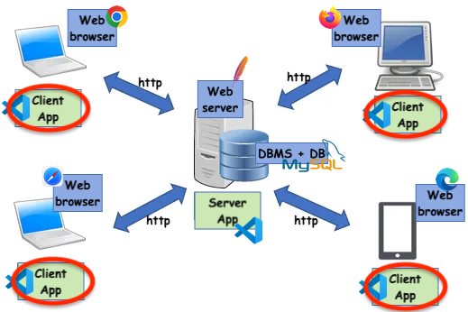

# Applicazioni Client Server su Web: il Client

Link utili<br/>
https://www.w3schools.com/w3css/w3css_input.asp<br/>
https://www.w3schools.com/html/html_form_input_types.asp



## Introduzione
Quando si crea un'applicazione Client Server su web, spesso si ha la necessità di permettere all'utente di inserire dei dati o di interagire con il sito stesso. In questi casi, si utilizzano i form HTML.

I form consentono di creare una struttura in cui l'utente può inserire dati, selezionare opzioni, e inviare il tutto al server per elaborare i dati inseriti. Grazie ai form, si può creare un'interazione tra il sito web e il server, che permette all'utente di usufruire dei servizi offerti dal sito stesso.


## Utilizzo dei form HTML
Il form (modulo) è uno strumento fondamentale per permettere all'utente di inviare dati al server e interagire con le pagine web. In particolare, i form client-side sono costituiti da una serie di elementi che possono essere utilizzati per raccogliere informazioni dall'utente e inviarle al server tramite una richiesta. Uno dei framework CSS più utilizzati per implementare i form è w3.css.<br/>
Un form si defisce con il tag html omonimo. Nell'esempio seguente si definisce un semplice form in cui è possibile inserire il proprio nome e cognome. Gli elementi utilizzabili nel form sono spiegati nei paragrafi successivi.

```html
...
<link rel="stylesheet" href="https://www.w3schools.com/w3css/4/w3.css">
...
<form class="w3-container w3-card-4 w3-light-grey">
  <h2>Registrazione</h2>
  <p>Inserisci i tuoi dati</p>
  <p><label>Nome</label>
  <input class="w3-input w3-border" name="nome" type="text"></p>
  <p><label>Cognome</label>
  <input class="w3-input w3-border" name="cognome" type="text"></p>
</form>
```

Che definisce il seguente form html:


Vediamo i principali elementi utilizzabili all'interno di un form.

[Clicca qui per continuare](./doc03_form.md)
