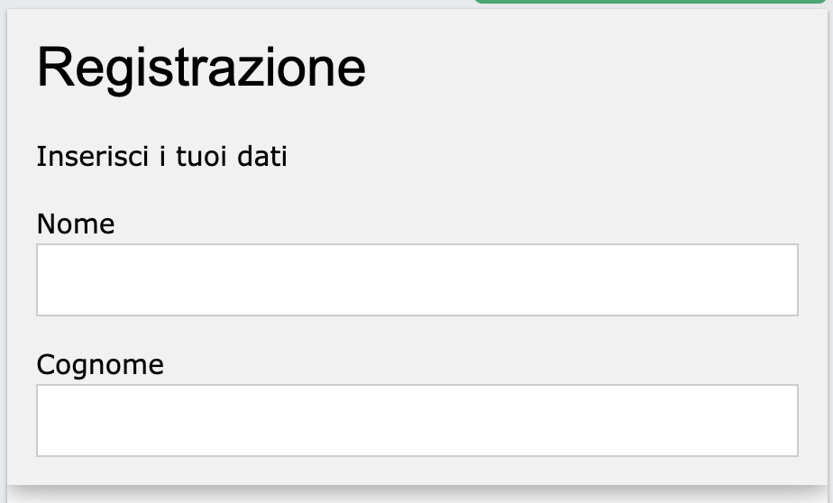
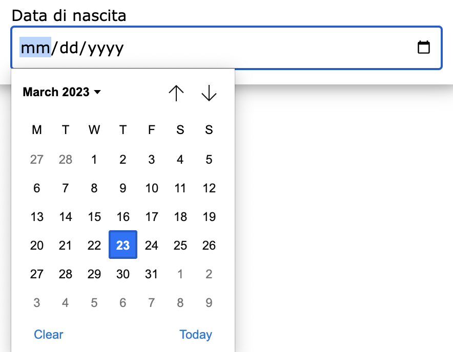

# Principali elementi utilizzabili all'interno di un form.



Vediamo i principali elementi utilizzabili all'interno di un form.

## Input di testo:
Gli input di testo sono utilizzati per consentire all'utente di inserire dati di testo alfanumerici. Si possono utilizzare per richiedere nome, cognome, indirizzo email e altro ancora.<br/>
Per esempio, come visto nell'esempio precedente si può utilizzare la seguente sintassi HTML per creare un input di testo con w3.css:

```html
<label>Cognome</label>
<input class="w3-input w3-border" type="text" name="cognome">
```
Il tag **label** viene utilizzato per descrivere l'input di testo. Il tag **input** definisce la casella di testo in cui poter scrivere.<br/>
L'attributo _type="text"_ stabilisce che l'input inserito è di tipo stringa. <br/>
L'attributo _name="cognome"_ definisce la variabile _cognome_ che potrà essere usata dal server quando riceverà i dati inseriti.

## Input numerico:
Gli input numerici sono simili a quelli di testo, ma consentono di inserire solo numeri. Possono essere utilizzati per richiedere l'età, il numero di telefono o altre informazioni numeriche. Un esempio di input numerico è il seguente:
```html
<label>Età</label>
<input class="w3-input" type="number" name="eta">
```
## Input di una data
Gli input per la data sono un altro tipo di input che può essere utilizzato nei form. Questi elementi consentono all'utente di selezionare una data tramite un calendario interattivo. Gli input per la data possono essere utilizzati per richiedere la data di nascita o di scadenza di un documento. Il seguente codice HTML può essere utilizzato per creare un input per la data con w3.css:

```html
<label>Data di nascita</label>
<input class="w3-input" type="date" name="dataNascita">
```
ottenendo il seguente risultato.


<br/>

## Esercizio
**DA SCRIVERE**


[Clicca qui per la prossima lezione](./doc04_form_pwd.md)

