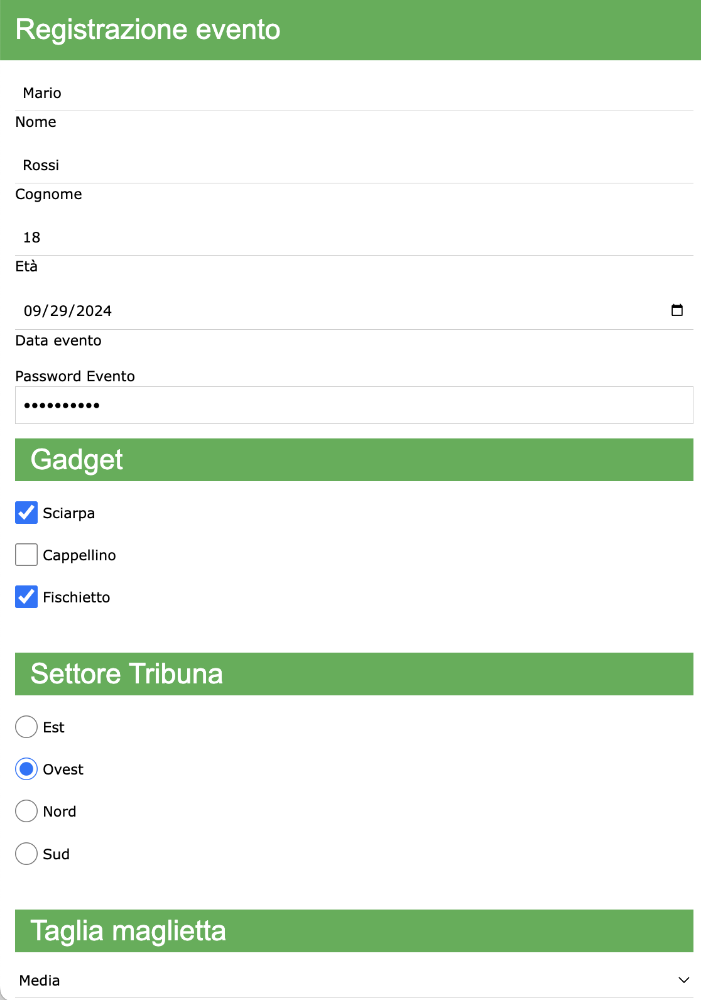

## Input di una password:
Una password non deve essere mostrata mentre viene digitata.<br/>
Si può utilizzare la seguente sintassi HTML per creare un input di tipo password:

```html
<label>Password</label>
<input class="w3-input w3-border" type="password" name="pwd">
```
Il tag **label** viene utilizzato per descrivere l'input. Il tag **input** definisce la casella di testo in cui poter inserire la password.<br/>
L'attributo _type="password"_ stabilisce che l'input inserito è di tipo password e che quindi non sarà visibile durante la digitazione. <br/>
L'attributo _name="pwd"_ definisce la variabile _pwd_ che potrà essere usata dal server quando riceverà i dati inseriti.

Aggiornando il nostro esempio con l'input password, si ottiene il seguente risultato.


<br/>

[Clicca qui per la prossima lezione](./doc05_form_checkbox.md)
