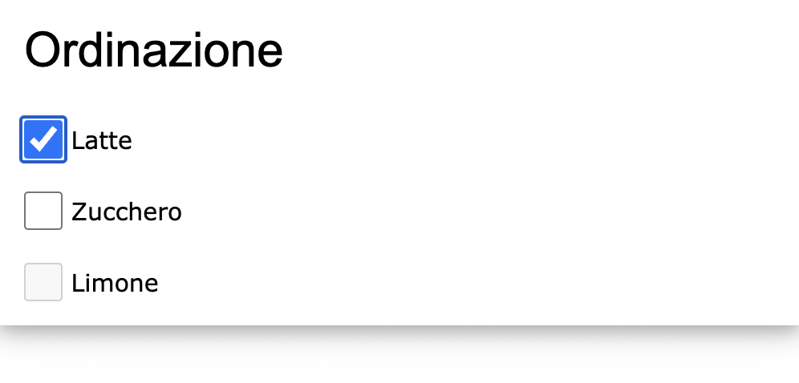
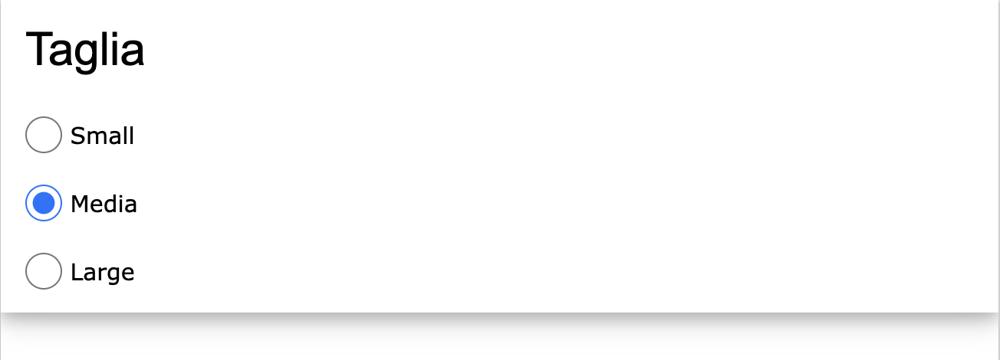
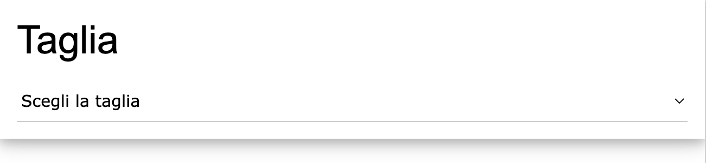
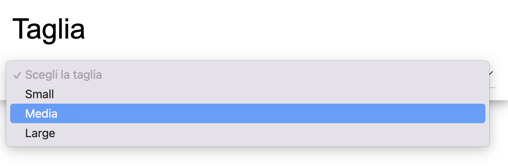

## Check Box e Radio Button:

### Introduzione
Nei form HTML, le check box e i radio button sono elementi molto utili per l'utente. Le check box consentono, fra le diverse opzioni disponibili, di selezionarne più di una contemporaneamente, mentre i radio button consentono la selezione di una sola opzione.<br/>


### Utilizzo delle Check Box
Le check box sono utili quando si vuole consentire all'utente di selezionare più opzioni contemporaneamente. Ad esempio, si possono utilizzare per selezionare le opzioni di un prodotto che l'utente desidera acquistare, come nel seguente esempio:

```html
<form class="w3-container w3-card-4">
  <h2>Ordinazione</h2>
  <p>
  <input class="w3-check" type="checkbox" name="ordine1" value="latte" checked="checked">
  <label>Latte</label></p>
  <p>
  <input class="w3-check" type="checkbox" name="ordine2" value="zucchero" >
  <label>Zucchero</label></p>
  <p>
  <input class="w3-check" type="checkbox" name="ordine3" value="limone" disabled >
  <label>Limone</label></p>
</form>
```
L'esempio genera il seguente form:


Nell'esempio abbiamo diverse opzioni da selezionare per l'ordinazione.
Il tag **label** viene utilizzato per descrivere ogni opzione. Gli attributi **name** e **value** vengono utilizzati per assegnare rispettivamente il nome ed il valore di ogni singola opzione. Nome e valore verranno passati al server che le tratterà come variabili di un programma (una variabile ha infatti un suo nome e relativo valore).

Il tag **checked** consente di selezionare una opzione per default, che l'utente potrà scegliere di disattivare. In questo caso Milk è già selezionato.
Il tag **disabled** disattiva un'opzione. In questo caso l'opzione limone è disattivata perchè incompatibile con l'opzione latte.

### Utilizzo dei Radio Button
I radio button, invece, sono utili quando si desidera che l'utente selezioni una sola opzione. Ad esempio, si possono utilizzare per la scelta del genere (maschile o femminile) o della taglia di un prodotto.

Ecco un esempio di codice HTML per l'utilizzo di un gruppo di radio button:

```html
<form class="w3-container w3-card-4">
  <h2>Taglia</h2>
  <p>
  <input class="w3-radio" type="radio" name="taglia" value="S">
  <label>Small</label></p>
  <p>
  <input class="w3-radio" type="radio" name="taglia" value="M" checked>
  <label>Media</label></p>
  <p>
  <input class="w3-radio" type="radio" name="taglia" value="L">
  <label>Large</label></p>
  <p>
</form>
```
L'esempio genera il seguente form:


In questo esempio, le tre opzioni ("Small", "Media" e "Large") sono raggruppate insieme grazie all'uso dell'attributo "name", impostato a "taglia" per tutte le opzioni. In questo modo, l'utente può selezionare una sola opzione.

### Alternativa ai Radio Button (le combobox)
Un modo alternativo per selezionare una sola opzione è rappresentato dalle combobox. In questo caso l'utente potrà scoprire tutte le opzioni disponibili solo dopo aver selezionato il pulsante combobox. Questa tecnica è molto utile quando la lista delle opzioni è molto lunga, come nel caso della selezione di una fra le tutte le possibili nazioni o province.

Ecco un esempio di codice HTML per l'utilizzo di una combo box:
```html
<form class="w3-container w3-card-4">
  <h1>Taglia</h1>

  <select class="w3-select" name="taglia">
    <option value="" disabled selected>Scegli la taglia</option>
    <option value="S">Small</option>
    <option value="M">Media</option>
    <option value="L">Large</option>
  </select>
  <p>
</form>
```
L'esempio genera il seguente form:


Dopo la selezione dell'opzione, l'utente potrà vedere tutte le opzioni possibili:



### Conclusioni
Le check box, i radio button e le combobox sono elementi fondamentali dei form HTML. Grazie al loro utilizzo, è possibile creare interfacce utente semplici ed intuitive. L'utilizzo di w3.css può aiutare a migliorare l'aspetto estetico delle check box e dei radio button, rendendoli più piacevoli alla vista.

<br/>